# Express Note Taker

This application is used to take notes from the user whenever they may need to do so, and it has the capabilities to save those notes and display them on the left hand side of the screen. It uses mainly Javascript to function, and is deployed on Heroku.

# Screenshots
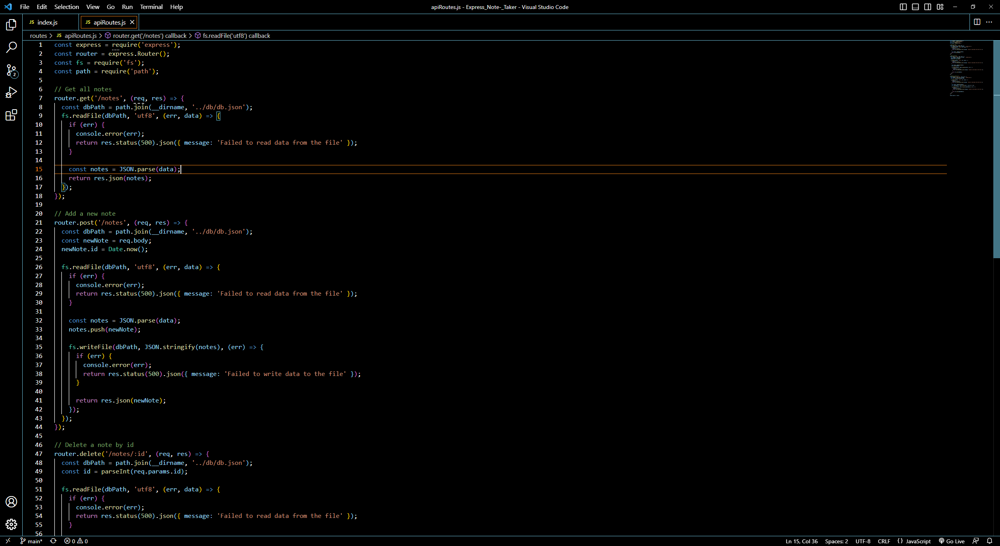
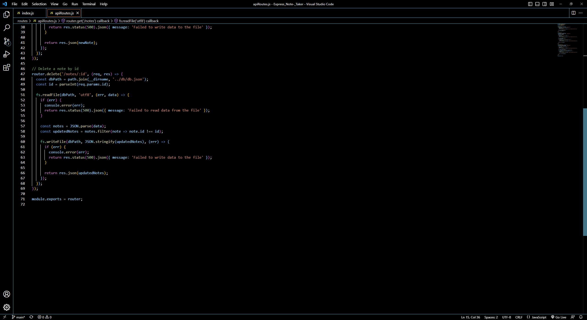
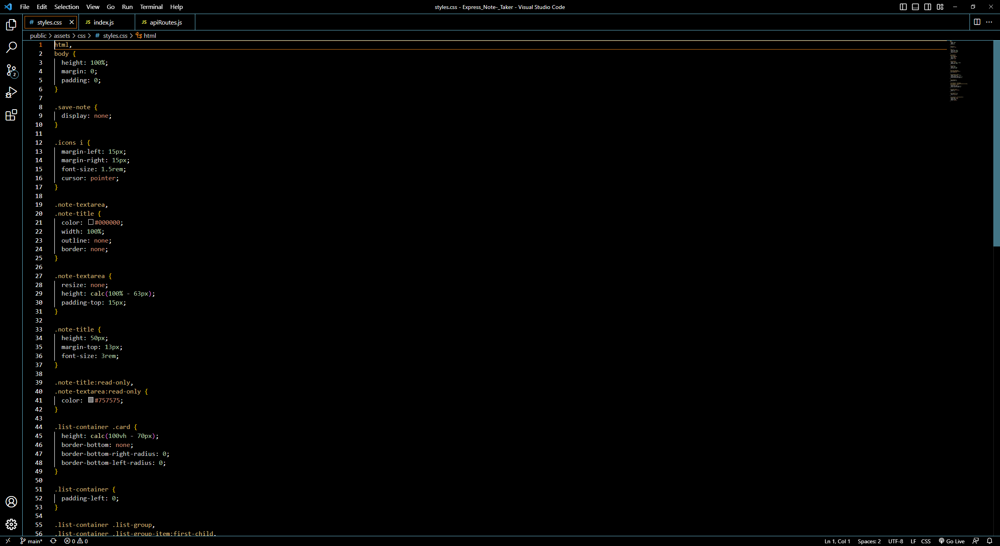
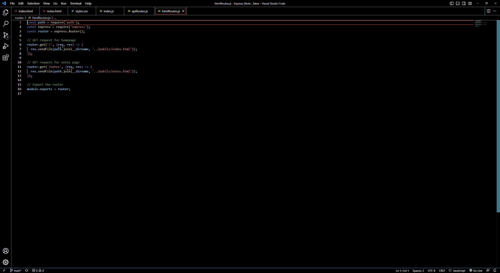
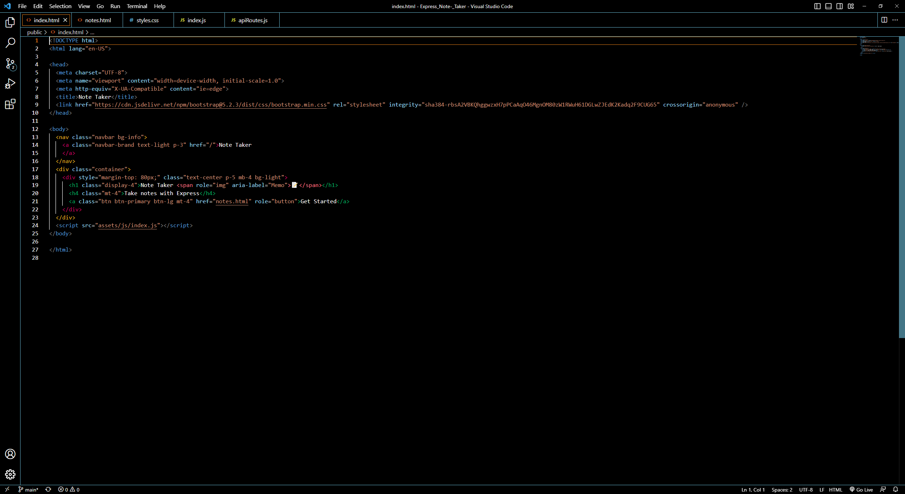
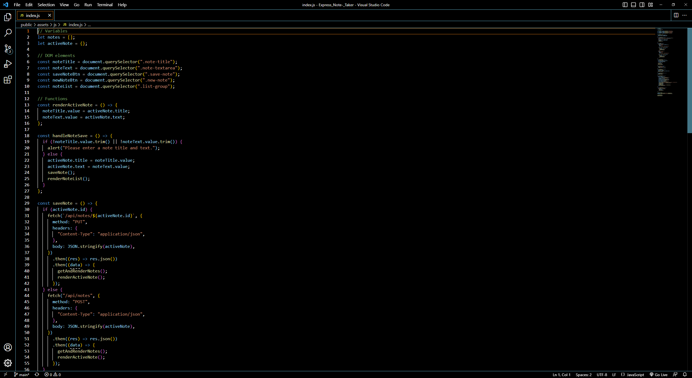
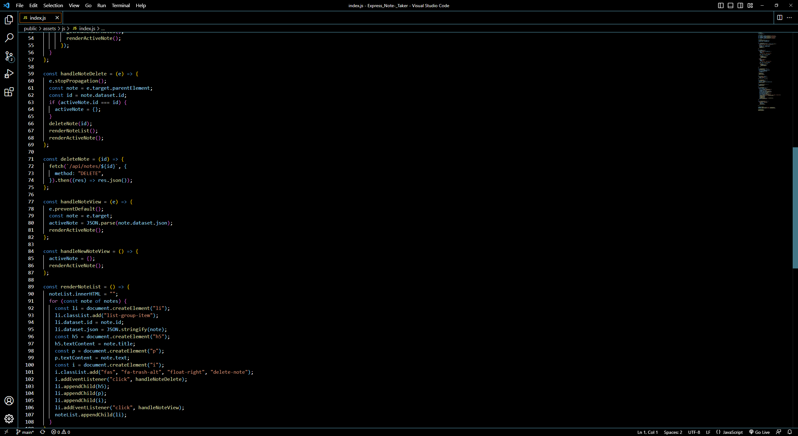
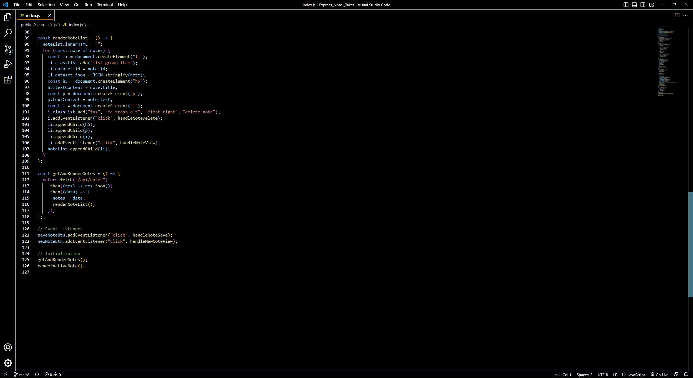
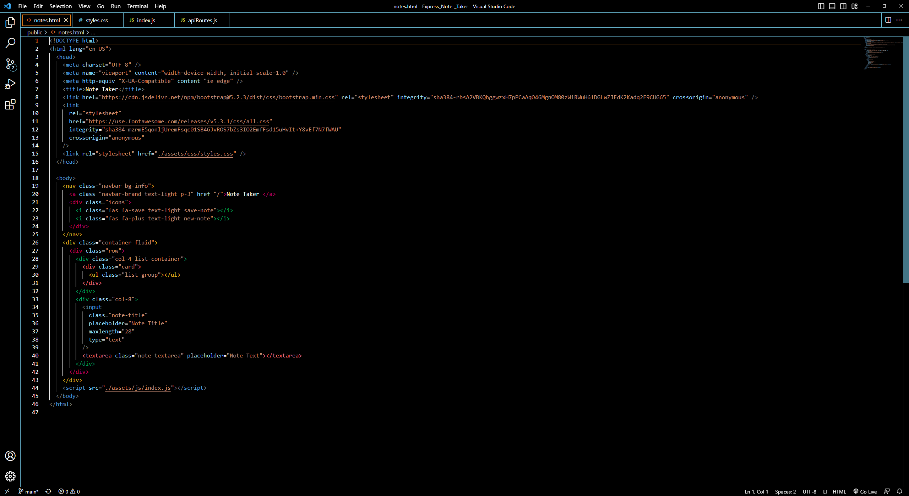
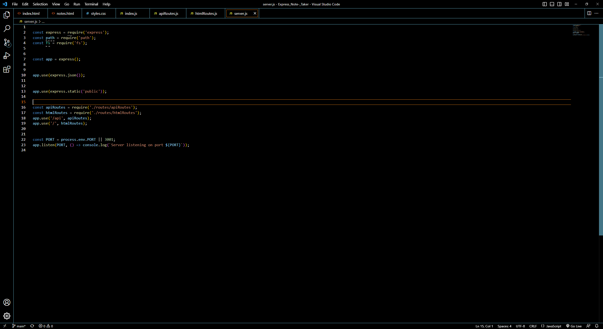

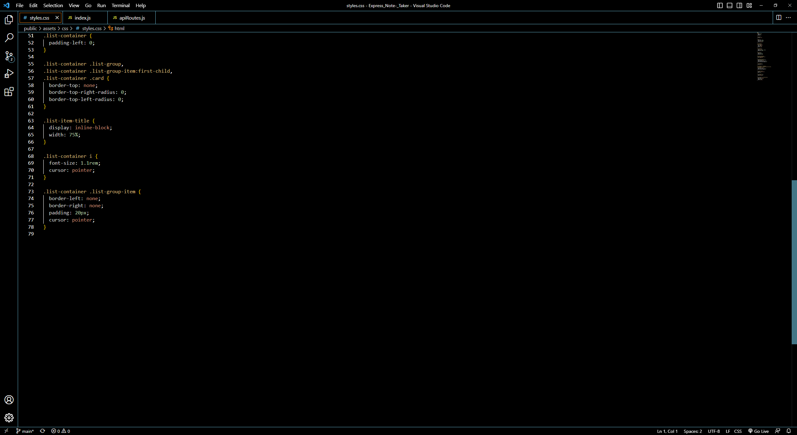

# Links

GitHub repository : https://github.com/Ervin543/Express_Note-_Taker

Deployed Application on Heroku : https://express-note-taker-1.herokuapp.com/
